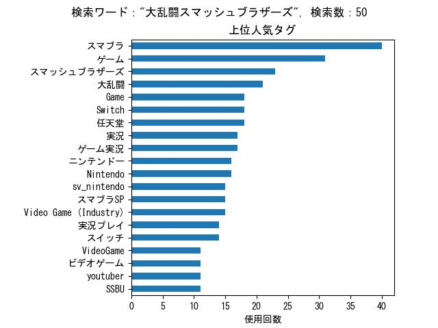

# プログラム名
YouTube Tag Finder

# 概要
任意の単語でYouTube検索し、ヒットした動画に付けられているタグを一括取得してグラフに表示します。



# 環境
- python -v 3.10.4

# 使用ライブラリ
- google-api-python-client -v 2.78.0
- matplotlib -v 3.7.0
- pandas -v 1.5.3
- python-dotenv -v 0.21.1

# 制作背景
YouTubeDataAPIを使って何かできないかと考え、当初は漠然とYouTubeDataAPIの公式ドキュメントを見ていました。その際に、動画投稿者が各動画に対して任意で付与できるタグの存在を知りました。

詳しく調べてみると、そのタグを視聴者が閲覧するには手間がかかることが分かりました。その反面、タグに設定された文字を知ることができれば、視聴者が新たな動画投稿者として同様の動画を投稿する際の助けになると考えました。

本プログラムを使用すれば、YouTube上の人気動画に付けられたタグを素早く収集し、可視化することができます。

# 利用方法
## 前提条件
- 本プログラムでは、YouTDataAPIを利用します。そのためGoogleアカウントをご用意のうえ、Google Cloud ConsoleにてYouTubeDataAPI v3を利用可能なAPI Keyを発行しておいてください。

（公式）YouTDataAPIの概要<br>
https://developers.google.com/youtube/v3/getting-started?hl=ja

## 手順
1. 本プログラムで使用している前述の各ライブラリを、PCにインストールしてください。
```
  $ pip install LIBRARY_NAME
```

2. ご自身のローカルPCで本プログラムを使用したいディレクトリに移動し、リポジトリをクローンしてください。
```
  例）デスクトップに作成済みのフォルダ"example"で実行する場合（OS:Windows, Shell:Bash）
  $ cd ~/Desktop/example
  $ git clone https://github.com/Malakir3/youtube_tag_finder.git
```
3. 以下のファイル・フォルダの名前を変更してください。
```
  .env_dummy → .env
  graph_dummy → graph
```
4. ファイル".env"に定義している各環境変数に対し、YouTubeDataAPI v3のAPI Keyや検索ワード、検索数を設定してください。<br>
なお、`CHANNEL_ID`は設定しなくても動作します。検索対象のYouTubeチャンネルを限定したい場合のみ、対象のチャンネルIDをこちらに設定し、`main.py`内のメソッド`youtube.search().list()`の引数に`channelId`を含めてください。

```
  # 例）
  DEVELOPER_KEY = "YOUR_YOUTUBE_API_KEY"
  YOUTUBE_API_SERVICE_NAME = "youtube"
  YOUTUBE_API_VERSION = "v3"
  CHANNEL_ID = "ANY_CHANNEL_ID" # 任意
  SEARCH_WORD = "大乱闘スマッシュブラザーズ" 
  MAX_RESULTS = "50"
```

5. main.pyを実行します。成功すれば、"graph"フォルダ内にjpg形式で画像ファイルが生成されます。
```
  $ python main.py
```
# 仕様
- `SEARCH_WORD`に設定した単語でYouTube上の動画を検索してヒットした動画を、再生回数の多い順にソートします。上位の検索結果から順番に、任意の数だけ動画のタグを取得します。タグを取得する動画の数は、`MAX_RESULTS`に設定した数値を変更することで調整できます。

# 目指した課題解決
新人YouTuberにとって、多くの人に動画を見てもらうためには戦略が必要です。その戦略の一つとして、動画に効果的なタグを付与することが挙げられます。これは、自身の投稿する動画に適切なタグを付与することにより、他の投稿者の動画との関連性をYouTube側に認識させることができるためです。

しかし、適切なタグとはどのようなものであるのかを判断するのは困難であり、正解があるとも限りません。適切なタグを見極めることは、新人YouTuberにとっては大きな課題です。

この課題を解決するために、本プログラムを作成しました。本プログラムは、再生回数の多い人気動画に付与されたタグをグラフ化して出力します。このグラフを閲覧することで、人気動画の投稿者が付与するタグの傾向を把握し、適切なタグとはどのようなものであるのかを判断することができます。

本プログラムが、新人YouTuberのタグ付け作業の役に立つことを願っています。

# 工夫したポイント
視認性を高めるために、結果を棒グラフで出力するようにしました。これにより、一目で各タグの人気度を把握することができます。

# 使用技術（開発環境）
## 言語
Python

## ソース管理
GitHub, SourceTree

## バージョン管理
Git for Windows

## エディタ
VSCode

## コードフォーマット
black -v 23.1.0

## OS
Windows 10 Home

# 課題、実装予定の機能
現状は、本プログラムを使用する環境を、利用者が各自で整える必要があります。そのため、使用開始のハードルが高い点が課題となっています。

今後は誰でも気軽に使用できるよう、アプリケーション化することを目指したいと思います。